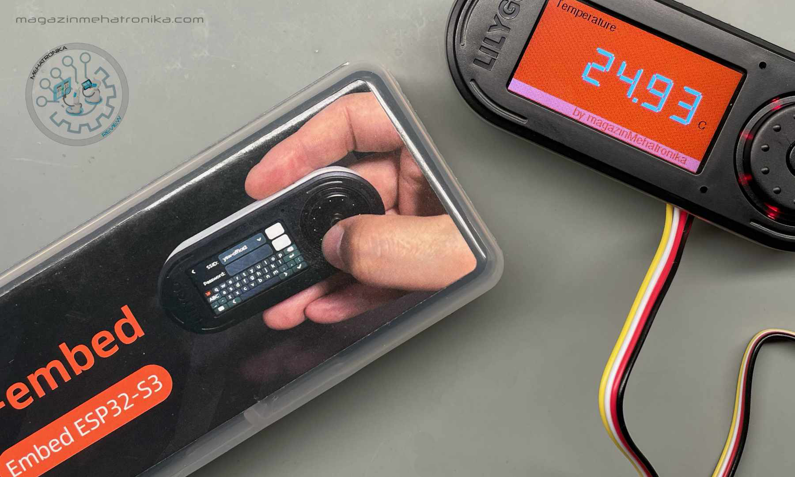
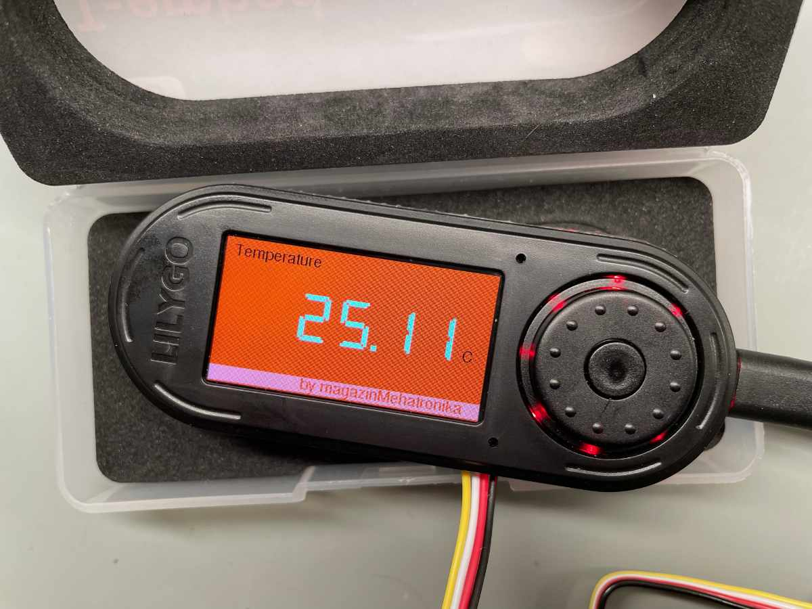
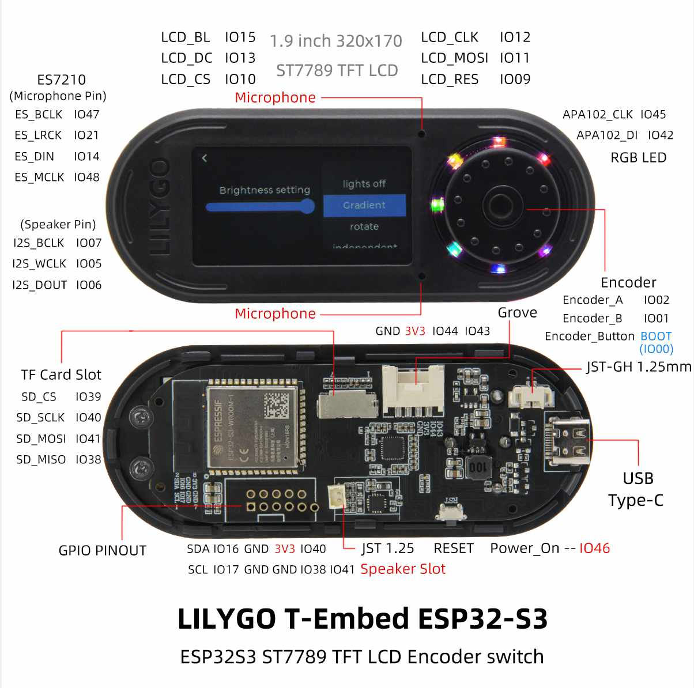
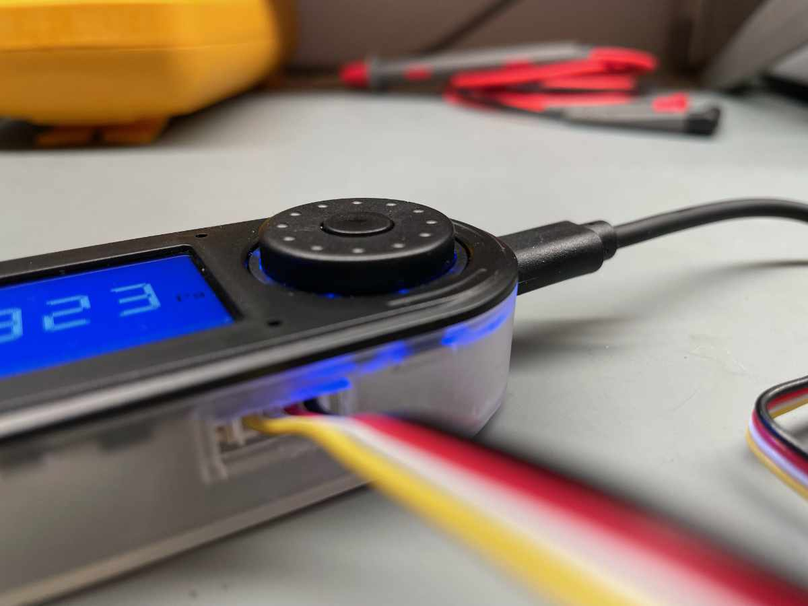
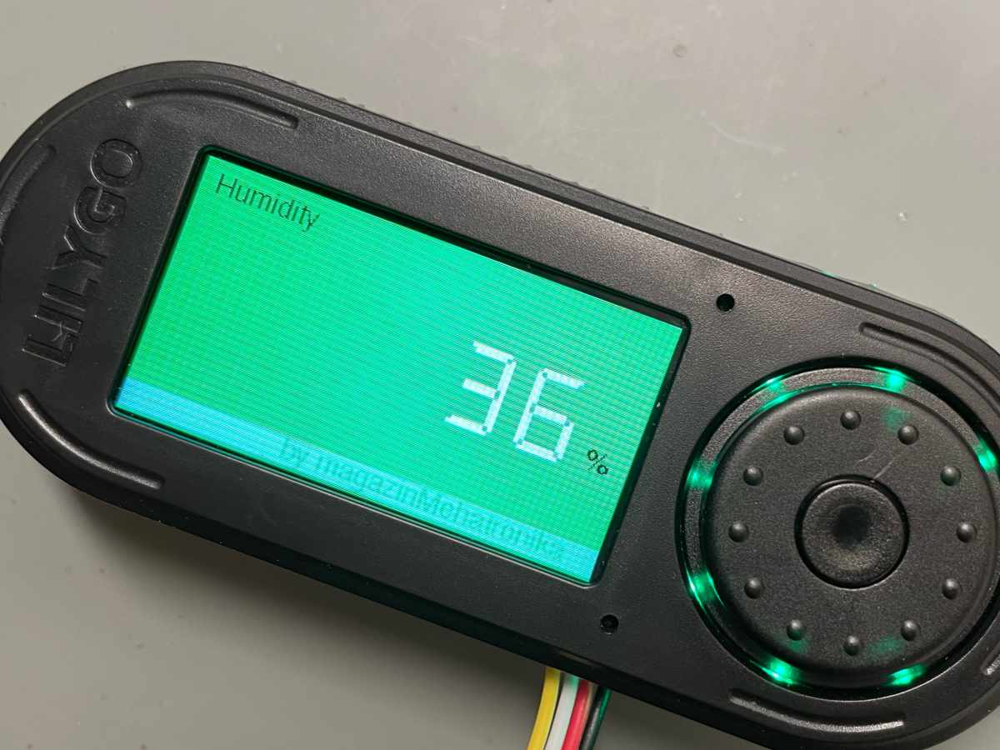
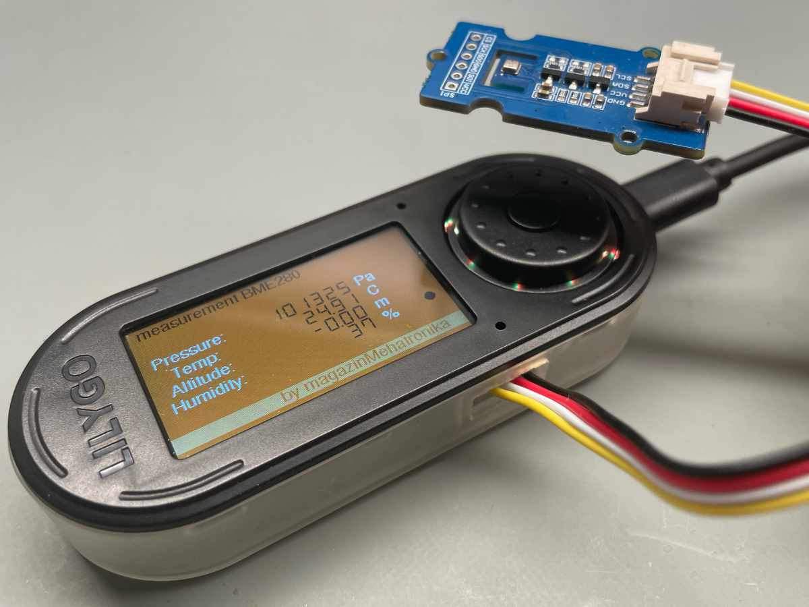

# LilyGO-T-Embed-review-demo
LilyGO / T-Embed : Review demo

Želja da se kreira funkcionalni uređaj po sopstvenoj zamisli nije lako ostvarljiva ukoliko se kreće od praznog papira. Razvojni sistemi jesu jedan korak koji olakšava isprobavanje ideje na nekoj platformi, ali se oni teško mogu spakovati u jedan funkcionalni proizvod. LilyGO svojim uređajima pokušava da napravi jedan korak ka gotovom proizvodu, ali ne baš bez žrtve u vidu ograničenja IO mogućnosti SoC-a. T-Embed je objedinjen sistem koga čine: ST7789 1.9″ 320×170 TFT Colour LCD, rotacioni enkoder, APA102 niz od 7 RGB dioda, mikrofon, zvučnik, jedan Grove konektor za eksterni senzor, slot za SD karticu i konektor za bateriju. Okosnica T-Embed-a je Espressif ESP32S3 u Wroom-1 SOC-u, sa 16 MB Flash i 8 MB PSRAM memorije, koji ima implementiran WiFi 802.11 b/g/n i BLE 5.

LilyGO T-Embed nam je stigao od proizvođača za potrebe ove recenzije. Spakovan u lepu, čvrstu providnu plastičnu kutiju i zaštićen držačem od sunđera. Uputstvo koje je došlo je u vidu papirne trake je dovoljno kao podsetnik za sve bitne IO definicije. U njoj su i heder i trakasti kabl za IDC3 konektor namenjen dibagu, dok je uobičajeni put za flešovanje i napajanje kroz ugrađeni USB-C. Tu je i dvožilni kratak kabal sa JST-GH 1.25mm konektorom za povezivanje opcione baterije, koja se ne nalazi u paketu. Ovo je lepa mogućnost koja obezbeđuje autonomnost uređaju.

Poželeli smo da se malo bolje upoznamo sa mogućnostima T-Embed-a, ali i da osetimo koliko je ugodno i lako kreirati aplikaciju. Preuzeli smo nekoliko gotovih aplikacija sa LilyGO Git-a i bez problema ih kompajlirali u 1.8.19 Arduino okruženju. Tu smo zastali, jer smo shvaili da Arduino u verziji 2 ne „ume“ da flešuje ESP32S3. Iako na sajtu proizvođača postoji uputstvo/preporuka da se aplikacija razvija u Arduino 2, a flešuje u Arduino 1.x, mi se iz iskustva držimo, ne samo u ovom slučaju, na verziji Arduino 1.8.19 za sve, koja uvek provereno radi – i sa bibliotekama i sa hardverom.

Osmislili smo veoma jednostavan školski primer osnovnog čitanja vrednosti sa Grove senzora i prkaz rezultata na ekranu, sa izborom okretanjem enkodera veličine koje se može prikazati uvećana na ekranu. Kao ulaz korišćen je Seeed Grove barometar senzor BME280, koji istovremeno meri pritisak, temperaturu i vlažnost. Veoma lako smo uz minimalno poznavanje programiranja i hardverske IO strukture T-Embed sistema došli do zadovoljavajuće pokazne aplikacije.

Da bi sve bilo u vidu gadžgeta, na našem 3-D Form Labs Form 3+ štampaču smo izradili zaštitnu kutiju kako bi u nju spakovali T-Embed. Fajl za kutijicu smo preuzeli sa LilyGO sajta.

Na kraju, nakon par dana „igranja“ i testiranja sa T-Embed-om naše mišljenje o ovom malom proizvodu namenjenom za ugradnju u veći uređaj koji sami kreirate je pozitivno. Već smo stavljanjem u namenski izrađenu kutiju dobili prenosni dopadljivi višenamenski uređaj. Zamerili bi postojanje samo jednog Grove porta i požalili se na enkoder koji je u ovom slučaju morao da bude najvišeg mogućeg kvaliteta, budući da je on, uz dugme u njegovoj sredini, glavni način interakcije sa uređajem. On je bio stalni izvor naših frustracija, jer nije uvek slušao naše namere, čak ni u demo aplikacijama koje dolaze sa T-Embed-om. I pored tog utiska ceo sistem je višenamenski, omogućava kreativna rešenja i po korektnoj ceni nudi pregršt hardverskih IO opcija.

